# TP2 DPBO 2025/2026 C2

## Janji
Saya Muhammad Rian Anugrah dengan NIM 2507241 mengerjakan Tugas Praktikum 2 pada Mata Kuliah Desain dan Pemrograman Berorientasi Objek (DPBO) untuk keberkahan-Nya maka saya tidak melakukan kecurangan seperti yang telah dispesifikasikan. Aamiin

## Struktur Folder

```
TP2DPBO2526C2/
├── Readme.md
├── CPP/
│   ├── Produk.cpp
│   ├── Pakaian.cpp
│   ├── Jaket.cpp
│   ├── Main.cpp
│   └── TestCase.txt
├── Java/
│   ├── Produk.java
│   ├── Pakaian.java
│   ├── Jaket.java
│   └── Main.java
├── Python/
│   ├── Produk.py
│   ├── Pakaian.py
│   ├── Jaket.py
│   └── Main.py
├── PHP/
│   ├── Produk.php
│   ├── Pakaian.php
│   ├── Jaket.php
│   ├── data.php
│   ├── Main.php
│   └── assets/
│       ├── image1.png
│       ├── image2.png
│       ├── image3.png
│       ├── image4.png
│       └── image5.png
└── Dokumentasi/
    ├── Diagram/
    │   └── diagram.png
    ├── Error/
    │   ├── error1.png
    │   ├── error2.png
    │   ├── error3.png
    │   ├── error4.png
    │   ├── error5.png
    │   ├── error6.png
    │   ├── error7.png
    │   ├── error8.png
    │   ├── error9.png
    │   ├── error10.png
    │   └── error11.png
    ├── CPP/
    │   ├── image1.png
    │   └── image2.png
    ├── Java/
    │   ├── image1.png
    │   └── image2.png
    └── Python/
        ├── image1.png
        └── image2.png
```

---

## Penjelasan Fitur

Program ini menerapkan **inheritance** (pewarisan) tiga tingkat pada domain produk pakaian, yaitu `Produk` → `Pakaian` → `Jaket`. Setiap kelas turunan mewarisi seluruh atribut kelas induknya lalu menambah atribut khasnya sendiri.

### Fitur Utama

- **Data awal**: program sudah memuat 5 data Jaket default sejak dijalankan, sehingga tabel langsung terisi tanpa perlu menambah data terlebih dahulu.
- **Pilihan aksi**: pengguna dapat memilih aksi yang tersedia, yaitu menampilkan data atau menambahkan data baru.
- **Tabel dinamis**: seluruh data yang tersimpan ditampilkan dalam bentuk tabel yang menyesuaikan diri dengan jumlah data, bukan tabel dengan jumlah baris tetap.
- **Input data baru**: pengguna dapat menginput data baru beserta seluruh atributnya. Setiap field divalidasi lebih dulu, mulai dari jumlah field, format tanda kutip, tipe data, sampai nilai `harga` dan `jumlah_saku`, dan data hanya disimpan bila seluruh field valid.
- **Data unik**: `id_produk` yang sama tidak dapat dipakai untuk menambahkan data lebih dari satu kali.
- **Dua jenis antarmuka**: versi C++, Java, dan Python berjalan di terminal dengan perintah `INSERT`, `SHOW`, dan `HELP` yang wajib diakhiri tanda titik koma `;`, sedangkan versi PHP berjalan di browser memakai form penambahan data.

### Atribut Foto (Khusus PHP)

Atribut `foto` hanya ada pada versi PHP. Field foto pada form berupa daftar pilihan yang diambil otomatis dari isi folder `assets/`, sehingga pengguna tidak perlu mengetik path secara manual, cukup memilih salah satu file foto yang tersedia. Nilai yang terpilih disimpan pada atribut `foto` dan foto tersebut langsung ditampilkan pada kolom pertama di dalam tabel. Foto boleh dikosongkan, dan baris yang tidak memilih foto akan menampilkan teks pengganti `belum ada foto`. Atribut ini tidak ada pada versi CLI karena program terminal tidak memiliki media untuk menampilkan gambar.

### Diagram Class

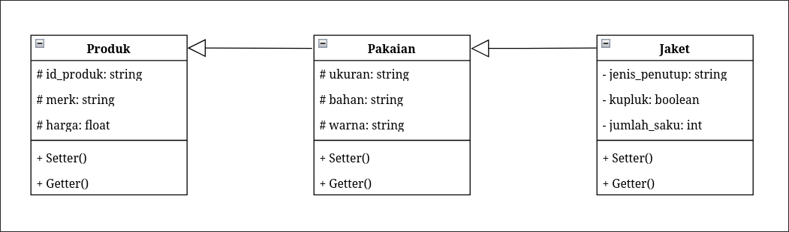

Pada diagram di atas terdapat tiga class yang hubungannya membentuk pewarisan bertingkat tiga, yaitu `Produk` sebagai class induk, `Pakaian` sebagai class turunan dari `Produk`, dan `Jaket` sebagai class turunan dari `Pakaian`.

### Penjelasan Class

- **`Produk`** adalah class induk yang menyimpan atribut dasar, yaitu `id_produk`, `merk`, dan `harga`. Atribut ini saya letakkan di sini karena semua yang dijual di toko pasti memiliki ID, merk, dan harga, sementara atribut seperti ukuran, bahan, dan warna tidak dimiliki produk berjasa seperti voucher atau pulsa. `Produk` saya jadikan class paling atas karena paling general sehingga cocok menjadi superclass, sehingga atribut dasar cukup ditulis sekali saja (prinsip DRY).
- **`Pakaian`** adalah class turunan `Produk` yang menambah atribut `ukuran`, `bahan`, dan `warna`. Ketiganya hanya relevan untuk produk yang dipakai pada tubuh, sedangkan produk seperti TV atau shampoo tidak memiliki ukuran dan warna yang berarti. Saya menjadikannya class perantara agar `Jaket` memakai atribut tersebut tanpa perlu menyalin ulang kodenya.
- **`Jaket`** adalah class turunan `Pakaian` yang menambah atribut `jenis_penutup`, `kupluk`, dan `jumlah_saku`. Ketiganya hanya relevan untuk jaket sehingga tidak saya letakkan di class atas agar class turunan lain seperti `Kaos` tidak memiliki atribut kosong. Saya memilih jaket karena ke depannya bisa ditambah `Kaos` atau `Kemeja` yang tetap mewarisi seluruh atribut tanpa menulis ulang.

---

## Error Handling Program CLI

### 1. Perintah Tidak Diakhiri Tanda Titik Koma
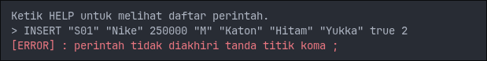

### 2. Jumlah Field INSERT Tidak Sesuai
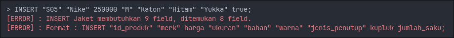

### 3. Field Teks Tidak Diapit Tanda Kutip
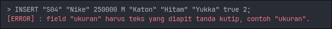

### 4. Field Angka atau Boolean Diapit Tanda Kutip
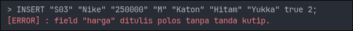

### 5. Harga Bukan Angka atau Tidak Lebih Besar dari 0
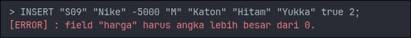

### 6. Nilai Kupluk Bukan true atau false
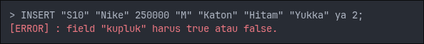

### 7. Jumlah Saku Bukan Bilangan Bulat 0 atau Lebih
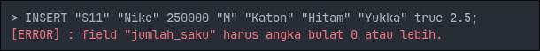

### 8. Field Teks Kosong
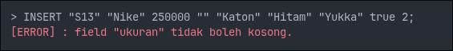

### 9. Tanda Kutip Tidak Berpasangan
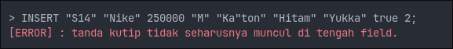

### 10. ID Produk Sudah Digunakan
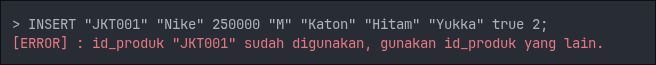

### 11. Perintah Tidak Diketahui
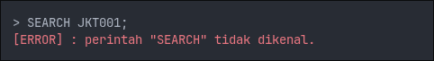

---

## Dokumentasi C++
### Compile dan Run
```bash
# Compile
cd CPP/
g++ Main.cpp -o Main

# Run
./Main
```

### 1. Menambahkan dan Menampilkan Data
Format perintah, field teks diapit tanda kutip sedangkan field angka dan boolean ditulis polos.
```bash
INSERT "id_produk" "merk" harga "ukuran" "bahan" "warna" "jenis_penutup" kupluk jumlah_saku;
SHOW;
```
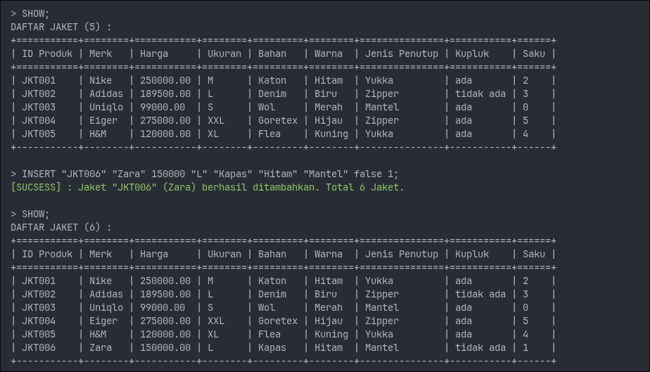

### 2. Menampilkan Bantuan
```bash
HELP;
```
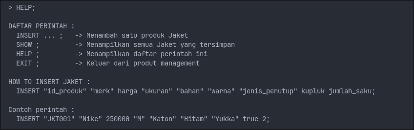

---

## Dokumentasi Java
### Compile dan Run
```bash
# Compile
cd Java/
javac Main.java

# Run
java Main
```

### 1. Menambahkan dan Menampilkan Data
Format perintah, field teks diapit tanda kutip sedangkan field angka dan boolean ditulis polos.
```bash
INSERT "id_produk" "merk" harga "ukuran" "bahan" "warna" "jenis_penutup" kupluk jumlah_saku;
SHOW;
```
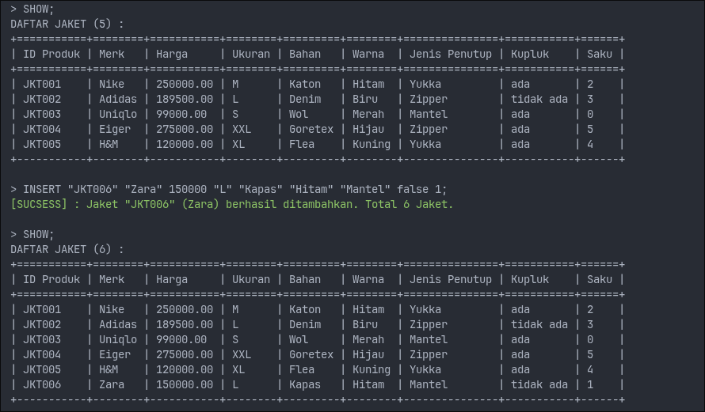

### 2. Menampilkan Bantuan
```bash
HELP;
```
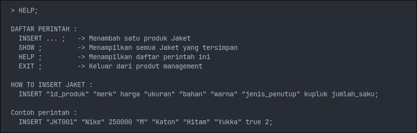

---

## Dokumentasi Python
### Compile dan Run
```bash
# Run
cd Python/
python Main.py
```

### 1. Menambahkan dan Menampilkan Data
Format perintah, field teks diapit tanda kutip sedangkan field angka dan boolean ditulis polos.
```bash
INSERT "id_produk" "merk" harga "ukuran" "bahan" "warna" "jenis_penutup" kupluk jumlah_saku;
SHOW;
```
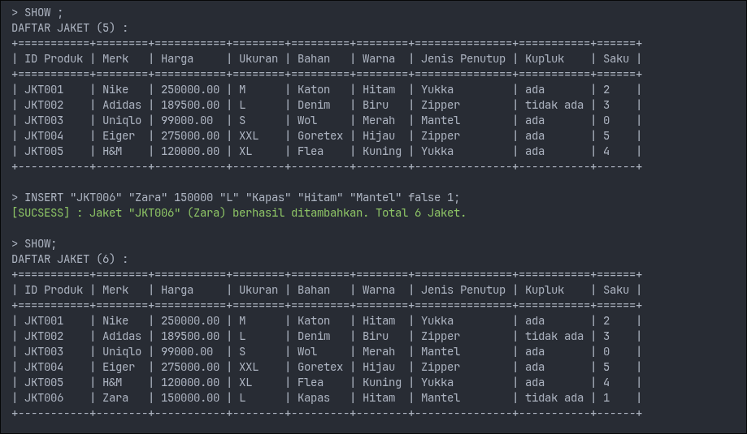

### 2. Menampilkan Bantuan
```bash
HELP;
```
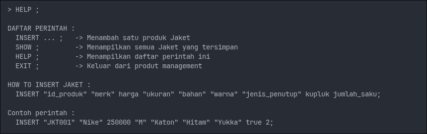

---

## Dokumentasi Web PHP

### Cara Menjalankan

1. Buka folder `PHP/`
    ```bash
    cd PHP/
    ```
2. Jalankan perintah:
   ```bash
   php -S localhost:8000
   ```
3. Buka browser dan akses `http://localhost:8000/Main.php`

### Tampilan Website

### Menambahkan Data
